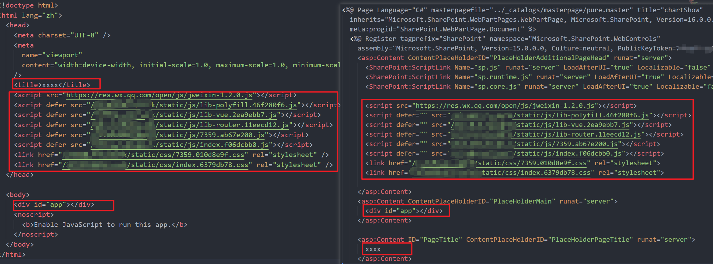

结合 [Sharepoint 本地代理](/posts/dev/pnp-local-link-sharepoint) 实现，这个功能很早就写好了并始终在使用，还算稳定，不过 Sharepoint 也因为国产化要丢掉了，也算是做一个记录留存吧。

## Table of contents

## 准备工作

pnpjs 分别提供了 node 版本和 web 版本，在 node 端使用自然要再安装 node 版本依赖

```bash
pnpm i @pnp/nodejs
```

### pnp.js 的文件上传使用

其实 Sharepoint 就是操作性更强的服务器，你只要把资源（ css + js + html）上传上去，并进行母版页（html）发版，所有人就都可以访问了，而上传文件就需要用到 pnpjs 的 api。

由于 pnpjs 目前仅支持 esm 模块，所以只能使用 import 来导入相关文件模块

```ts
// pnpjs 上传文件需要的最基础依赖
import { spfi } from "@pnp/sp";
import { SPDefault } from "@pnp/nodejs";
import "@pnp/sp/webs";
import "@pnp/sp/files";
import "@pnp/sp/folders";

const sp = spfi().using(
  SPDefault({
    // 利用 sp-rest-proxy 实现的 Sharepoint 代理地址
    baseUrl: "https://localhost:9999",
  })
);

// 文件夹创建 api
sp.web.folders.addUsingPath("/myFolder");
// 文件上传 api 将 index.js 文件上传到 myFolder 文件夹下，并写入内容 Hello world
await sp.web
  .getFolderByServerRelativePath("/myFolder")
  .files.addUsingPath("index.js", textDecoder.decode(`Hello world`), {
    Overwrite: true,
  });
```

## 实现文件上传

OK，大致了解之后，我们就有思路该如何实现了

- 打包项目
- 上传项目
  - 获取打包后的目录结构并在 Sharepoint 中创建对应结构
  - 上传文件（获取本地文件对应的 Sharepoint 相对路径，在 Sharepoint 中创建文件并写入内容）
  - 递归查询文件夹中的文件并上传
- 母版页的创建及相关打包 js 的动态引入
  - 上传母版页
  - 对母版页进行发版

这里使用 `tsx` 来运行脚本

```ts
import path from "node:path";
import fs from "node:fs";
import inquirer from "inquirer";

// pnp 仅支持 esm
import { spfi } from "@pnp/sp";
import { SPDefault } from "@pnp/nodejs";
import "@pnp/sp/webs";
import "@pnp/sp/files";
import "@pnp/sp/folders";

import pLimit from "p-limit";

const limit = pLimit(6);

const textDecoder = new TextDecoder("utf-8");

// 由于代理为 https ，需要忽略证书验证
process.env.NODE_TLS_REJECT_UNAUTHORIZED = "0";

const sp = spfi().using(
  SPDefault({
    baseUrl: "https://localhost:9999", // proxy 代理地址
  })
);

const BaseConfig = {
  sitePageDir: "/SitePages",
  pageName: "mypage.aspx", // Sharepoint 母版页名称
  siteAssetDir: "/SiteAssets/mypage", // Sharepoint 资源目录文件名
  distDir: path.join(process.cwd(), "dist"), // 打包后的目录
};

async function uploadFileToSharePoint(localPath: string, remotePath: string) {
  try {
    const fileContent = fs.readFileSync(localPath);
    const fileName = path.basename(localPath);
    console.log(`正在上传文件: ${fileName} to ${remotePath}`);

    await sp.web
      .getFolderByServerRelativePath(remotePath)
      // 这里 decode 是为了确保文件内容能够被 pnp 正确解析，比如 buffer 类型在上传时就会出现内容错乱
      .files.addUsingPath(fileName, textDecoder.decode(fileContent), {
        Overwrite: true,
      });

    console.log(`文件上传成功: ${fileName}`);
  } catch (error) {
    console.error(`文件上传失败: ${path.basename(localPath)}`, error);
    throw error;
  }
}

async function handleAssets(localPath: string, remotePath: string) {
  const items = fs.readdirSync(localPath, { withFileTypes: true });

  // 递归查找文件夹结构，先把文件夹创建好
  for (const item of items.filter((d) => d.isDirectory())) {
    const localFullPath = path.join(localPath, item.name);
    const remoteFullPath = path.posix.join(remotePath, item.name);

    await sp.web.folders.addUsingPath(remoteFullPath);
    await handleAssets(localFullPath, remoteFullPath);
  }

  // 再处理所有文件
  await Promise.all(
    items
      .filter((item) => item.isFile())
      .map((item) =>
        limit(() =>
          uploadFileToSharePoint(path.join(localPath, item.name), remotePath)
        )
      )
  );
}

async function deployAssets() {
  const localBasePath = BaseConfig.distDir;
  const remoteBasePath = BaseConfig.siteAssetDir;
  // 再上传前先把旧资源删除
  await sp.web.getFolderByServerRelativePath(remoteBasePath).delete();
  // 创建根文件夹
  await sp.web.folders.addUsingPath(remoteBasePath);
  try {
    console.log("🚀 Asset 资源部署中...");
    await handleAssets(localBasePath, remoteBasePath);
  } catch (error) {
    console.error("❌ Asset 资源部署失败:", error);
    throw error;
  }
}

deployAssets();
```

此时这个脚本已经可以把静态资源部署到 Sharepoint 上了

## 母版页的创建及相关打包资源的动态引入

首先，你打包时的访问地址的 baseUrl 要和线上对应的上，比如线上访问地址为 `https://mysharepoint.com/sites/mySite`，那么打包时 `baseUrl` 要设置为 `/sites/mySite`

其次，其实打包好的 html 结构和母版页是非常接近的，以下是对比图



那么我们实际上就可以把母版页不变的内容作为纯静态内容，然后把动态内容`script` `link` 等提取出来插入进入即可，这里借助 [cheerio](https://cheerio.js.org) 就可以实现，它专门提取 xml 和 html 的结构内容，代码见最后部分

## 母版页的发布

这个就再次回到部署资源的文件

```ts
async function deployAspxPage() {
  // 在部署前先 node 运行生成母版页的 js 文件
  const workPagePath = path.join(__dirname, "../dist/mypage.aspx");
  const fileContent = fs.readFileSync(workPagePath);
  const targetPage = `${BaseConfig.sitePageDir}/${BaseConfig.pageName}`;

  console.log("🚀 Page 页面部署中...");
  await sp.web.getFolderByServerRelativePath(targetPage).delete();
  await sp.web
    .getFolderByServerRelativePath(BaseConfig.sitePageDir)
    .files.addUsingPath(BaseConfig.pageName, textDecoder.decode(fileContent), {
      Overwrite: true,
    });

  try {
    const file = sp.web.getFileByServerRelativePath(targetPage);
    // 签出
    // await file.checkin('Updated by script', CheckinType.Major);
    // 发布
    await file.publish("Published by mobile script");
    console.log(`📄 Page 替换并发布成功`);
  } catch (error) {
    console.error(`❌ Page 页面更新页面更新失败: `, error);
    throw error;
  }
}
```

## 使用 inquirer 来控制部署可选项

这一步不是非必须的，简单使用的话就跟你使用各种 CLI 工具来创建项目时效果差不多，选择某项执行对应的逻辑

简单使用

```js
import inquirer from "inquirer";

// prompt 返回的是一个 Promise
const selectedValue = await inquirer.prompt([
  {
    type: "list",
    name: "selectType",
    message: "请选择类型:",
    choices: [
      { name: "A", value: "a" },
      { name: "B", value: "b" },
      { name: "C", value: "c" },
    ],
  },
]);

if (selectedValue.selectType === "a") {
  // ...
} else if (selectedValue.selectType === "b") {
  // ...
} else if (selectedValue.selectType === "c") {
  // ...
}
```

如果在部署前需要告知使用者一些东西，进行一些提示，比如使用者必须输入 y 回车才会触发部署逻辑，则可以使用 node 内置的 `process.stdout` 和 `process.stdin`

```js
async function confirmDeployment(): Promise<boolean> {
  return new Promise((resolve) => {
    process.stdout.write("是否确认部署？(Y/N) ");
    process.stdin.setEncoding("utf8");
    process.stdin.once("data", (data) => {
      const input = data.toString().trim().toLowerCase();
      resolve(input === "y");
    });
  });
}
```

## 完整脚本

`npm run build && node generateAspx.js && tsx deploy.ts`

`generateAspx.js`

```js
const path = require("path");
const fs = require("fs");
const cheerio = require("cheerio");

const readPth = path.join(__dirname, "../dist/index.html");
const outputPath = path.join(__dirname, "../dist/mypage.aspx");

const html = fs.readFileSync(readPth, "utf8");
const $ = cheerio.load(html);

const siteTitle = $("title").text();
const coreDistFilePath = [];
const extraScript = [];

// 构建资源 提取 head 中的 script 和 link
$("head script, head link").each((i, el) => {
  coreDistFilePath.push($(el).toString());
});
// 提取额外注入的 script
$("body script").each((i, el) => {
  extraScript.push($(el).toString());
});

const mountDiv = $("#app").toString();

const template = `
<%@ Page Language="C#" masterpagefile="../_catalogs/masterpage/cwePureMobile.master" title="chartShow"
  inherits="Microsoft.SharePoint.WebPartPages.WebPartPage, Microsoft.SharePoint, Version=16.0.0.0, Culture=neutral, PublicKeyToken=xxxxx"
  meta:progid="SharePoint.WebPartPage.Document" %>
  <%@ Register tagprefix="SharePoint" namespace="Microsoft.SharePoint.WebControls"
    assembly="Microsoft.SharePoint, Version=15.0.0.0, Culture=neutral, PublicKeyToken=xxxxx" %>
    <asp:Content ContentPlaceHolderID="PlaceHolderAdditionalPageHead" runat="server">
      <SharePoint:ScriptLink Name="sp.js" runat="server" LoadAfterUI="true" Localizable="false" />
      <SharePoint:ScriptLink Name="sp.runtime.js" runat="server" LoadAfterUI="true" Localizable="false" />
      <SharePoint:ScriptLink Name="sp.core.js" runat="server" LoadAfterUI="true" Localizable="false" />

      ${coreDistFilePath.join("\n      ")}

    </asp:Content>
    <asp:Content ContentPlaceHolderID="PlaceHolderMain" runat="server">
      ${mountDiv}
      ${extraScript.join("\n      ")}
    </asp:Content>

    <asp:Content ID="PageTitle" ContentPlaceHolderID="PlaceHolderPageTitle" runat="server">
      ${siteTitle}
    </asp:Content>
`;

if (fs.existsSync(outputPath)) {
  fs.rmSync(outputPath);
}

// 写入文件，创建母版页
fs.writeFileSync(outputPath, template);
```

`deploy.ts`

```ts
import path from "node:path";
import fs from "node:fs";
import inquirer from "inquirer";

// pnp 仅支持 esm
import { spfi } from "@pnp/sp";
import { SPDefault } from "@pnp/nodejs";
import "@pnp/sp/webs";
import "@pnp/sp/files";
import "@pnp/sp/folders";

import pLimit from "p-limit";

const limit = pLimit(6);

const textDecoder = new TextDecoder("utf-8");

// 忽略证书验证
process.env.NODE_TLS_REJECT_UNAUTHORIZED = "0";

const sp = spfi().using(
  SPDefault({
    baseUrl: "https://localhost:9999", // proxy 代理地址
  })
);

const BaseConfig = {
  sitePageDir: "/SitePages",
  pageName: "work.aspx",
  siteAssetDir: "/SiteAssets/work",
  distDir: path.join(process.cwd(), "dist"),
};

async function uploadFileToSharePoint(localPath: string, remotePath: string) {
  try {
    const fileContent = fs.readFileSync(localPath);
    const fileName = path.basename(localPath);
    console.log(`📤 正在上传文件: ${fileName} to ${remotePath}`);

    await sp.web
      .getFolderByServerRelativePath(remotePath)
      .files.addUsingPath(fileName, textDecoder.decode(fileContent), {
        Overwrite: true,
      });

    console.log(`📦 文件上传成功: ${fileName}`);
  } catch (error) {
    console.error(`❌ 文件上传失败: ${path.basename(localPath)}`, error);
    throw error;
  }
}

async function processDirectory(localPath: string, remotePath: string) {
  const items = fs.readdirSync(localPath, { withFileTypes: true });

  // 先把文件夹创建好
  for (const item of items.filter((d) => d.isDirectory())) {
    const localFullPath = path.join(localPath, item.name);
    const remoteFullPath = path.posix.join(remotePath, item.name);

    await sp.web.folders.addUsingPath(remoteFullPath);
    await processDirectory(localFullPath, remoteFullPath);
  }

  // 再处理所有文件
  await Promise.all(
    items
      .filter((item) => item.isFile() && item.name !== "work.aspx")
      .map((item) =>
        limit(() =>
          uploadFileToSharePoint(path.join(localPath, item.name), remotePath)
        )
      )
  );
}

async function deployAssets() {
  const localBasePath = BaseConfig.distDir;
  const remoteBasePath = BaseConfig.siteAssetDir;
  await sp.web.getFolderByServerRelativePath(remoteBasePath).delete();
  await sp.web.folders.addUsingPath(remoteBasePath); // 创建文件夹
  try {
    console.log("🚀 Asset 资源部署中...");
    await processDirectory(localBasePath, remoteBasePath);
  } catch (error) {
    console.error("❌ Asset 资源部署失败:", error);
    throw error;
  }
}

async function deployAspxPage() {
  const workPagePath = path.join(__dirname, "../dist/work.aspx");
  const fileContent = fs.readFileSync(workPagePath);
  const targetPage = `${BaseConfig.sitePageDir}/${BaseConfig.pageName}`;

  console.log("🚀 Page 页面部署中...");
  await sp.web.getFolderByServerRelativePath(targetPage).delete();
  await sp.web
    .getFolderByServerRelativePath(BaseConfig.sitePageDir)
    .files.addUsingPath(BaseConfig.pageName, textDecoder.decode(fileContent), {
      Overwrite: true,
    });

  try {
    const file = sp.web.getFileByServerRelativePath(targetPage);
    // 签出
    // await file.checkin('Updated by script', CheckinType.Major);
    // 发布
    await file.publish("Published by mobile script");
    console.log(`📄 Page 替换并发布成功`);
  } catch (error) {
    console.error(`❌ Page 页面更新页面更新失败: `, error);
    throw error;
  }
}

async function main() {
  try {
    const confirmed = await confirmDeployment();
    if (!confirmed) {
      console.log("🚫 已取消部署");
      process.exit(0);
    }

    const { deployType } = await selectDeployType();

    switch (deployType) {
      case "all":
        await deployAssets();
        await deployAspxPage();
        break;
      case "assets":
        await deployAssets();
        break;
      case "page":
        await deployAspxPage();
        break;
    }

    console.log("✅ 部署成功!");
    process.exit(0);
  } catch (error) {
    console.error("❌ 部署失败:", error);
    process.exit(1);
  }
}

main();

async function confirmDeployment(): Promise<boolean> {
  return new Promise((resolve) => {
    process.stdout.write("请确保已执行 pnpm build, 是否继续部署？(Y/N) ");
    process.stdin.setEncoding("utf8");
    process.stdin.once("data", (data) => {
      const input = data.toString().trim().toLowerCase();
      resolve(input === "y");
    });
  });
}

async function selectDeployType(): Promise<{
  deployType: "page" | "assets" | "all";
}> {
  return inquirer.prompt([
    {
      type: "list",
      name: "deployType",
      message: "请选择部署类型:",
      choices: [
        { name: "全量发布", value: "all" },
        { name: "发布资源(dist)", value: "assets" },
        { name: "发布页面(work.aspx)", value: "page" },
      ],
    },
  ]);
}
```

至此，结束！
