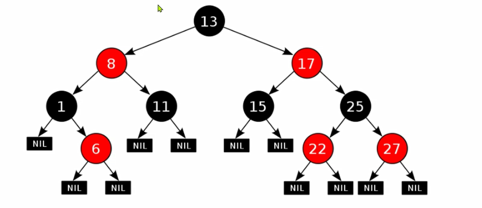

所有笔记内容基于网络上的黑马视频课程自行整理...

## Table of contents

## 面向对象

### 基础

#### this 关键字

跟前端的 this 差不多，就近原则。

- 当局部变量和成员变量重名时，可以通过 this 访问成员变量
- 访问成员变量，当不涉及重名问题时， this 可以省略
- 调用成员方法，this 可以直接省略

```java
public class Test {
  private String name;

  public void setName(String name) {
    System.out.println(this.name)
    this.name = name;
  }

  public void ignoreThis() {
    // 省略 this 也可以
    System.out.println(name);
    setName("张三");
  }
}
```

- this 代表当前类的地址引用。

```java
public class Person {
 private String name;

 public void printThis() {
   System.out.println(this);
 }
}

public class Test {
 public static void main(String[] args) {
   Person person = new Person();
   System.out.println(person); // Person@1b6d3586
   person.printThis(); // Person@1b6d3586
 }
}
```

#### 构造方法

不写的话 Java 会默认生成一个无参构造方法，可以 IDEA 右键 Generate 快速生成，后边有 lombok 就不这么麻烦了。

- 无返回类型，无 void，无 return 值
- 会在创建对象时调用。

```java
public class Person {
  String name;
  int age;

  // 无参和有参其实就是重载
  public Person() {
    System.out.println("无参构造方法");
  }

  public Person(String name, int age) {
      this.name = name;
      this.age = age;
      System.out.println("有参构造方法");
  }
}

public class Test {
  public static void main(String[] args) {
    Person person = new Person();
    System.out.println(person.name); // null 无参构造方法
    Person person1 = new Person("张三", 18)
    System.out.println(person1.name); // 张三 有参构造方法
  }
}
```

#### 权限修饰符

| 修饰符    | 当前类中 | 当前包中 | 不同包的子类 | 不同包的非子类 |
| --------- | -------- | -------- | ------------ | -------------- |
| private   | √        |          |              |                |
| (default) | √        | √        |              |                |
| protected | √        | √        | √            |                |
| public    | √        | √        | √            | √              |

protected 开发中基本用不到

```java
// com.example.a;
public class Base {
    protected int value = 42;   // protected 成员
}

// com.example.a; 同包非子类
public class SamePackage {
    public void access(Base b) {
        System.out.println(b.value);  // ✅ 可以访问（同包）
    }
}
//  com.example.b; 不同包子类
public class Subclass extends Base {
    public void access() {
        System.out.println(value);     // ✅ 可以访问（子类继承）
    }
}
// com.example.b; 不同包非子类
public class NonSubclass {
    public void access(Base b) {
        // System.out.println(b.value); // ❌ 编译错误
    }
}
```

#### JavaBean

开发中的数据实体都用这个

- JavaBean 类的属性必须私有，并且提供 getter 和 setter 方法。
- JavaBean 类必须提供无参和有参构造方法。

#### static 关键字

- static 修饰的成员变量，被该类下的所有对象共享
- static 修饰的才可以通过 `Student.name`（直接类名访问无需 new） 访问静态成员变量并赋值（推荐）
- 随着类加载而创建，优于对象存在。`Student.schoolName="清华大学"` 可以在 `new Student()` 之前赋值。

```java
public class Student {
  public static String schoolName;
  public int age;
}

public class Test {
  public static void main(String[] args) {
    Student.schoolName = "清华大学";

    Student student = new Student();
    System.out.println(student.schoolName); // 清华大学

    Student student1 = new Student();
    System.out.println(student1.schoolName); // 清华大学
  }
}
```

注意事项：

- static 修饰的方法只能**直接访问** static 修饰的成员变量
- static 静态方法内没有 this 关键字

### 高级

#### 继承 extends

继承是面向对象三大特征之一，封装、继承、多态。

跟前端的 TS 差不多，子类 extends 父类，子类会继承父类的属性和方法（除了私有属性和方法），在实际场景中，需要继承的父类一般都是公共属性的基类。

- 当子类和父类存在同名成员变量时，直接访问到的是子类的成员变量（就近原则），如果想访问父类的，可以通过 `super.变量名`

```java
public class Person {
  int sex="男"
}

public class Student extends Person {
  int sex="女";

  public void printSex() {
    int sex="未知";
    System.out.println(sex); // 未知
    System.out.println(this.sex); // 女
    System.out.println(super.sex); // 男
  }
}
```

- 当子类和父类存在同名方法（**方法名入参返回值都一致**）时，子类可以用 `@Override` 重写父类的方法，重写时，也必须保持方法名入参返回值都一致，不然报错。

```java
public class Father {
  public void love() {
    System.out.println("三大件：手表、自行车、缝纫机");
  }
}

public class Son extends Father {
  @Override
  public void love() {
    System.out.println("三大件：房、车、钱");
  }

  // 方法名相同，但是入参/返回值不一致，就不属于重写，属于重载
  public void love(String gender){
    System.out.println("三大件：房、车、钱");
  }
}
```

- 继承的一些访问特性

1. 子类无法继承父类的构造方法
2. 子类在初始化时，系统会自动调用父类的构造方法，父类构造方法早于子类构造方法执行，因为子类很有可能通过 super 访问父类的变量或方法
3. 基于第 2 点，子类所有的构造方法，首行默认添加 super() 从而完成调用父类的构造方法

```java
public class Father {
  public Father() {
    System.out.println("父类无参构造方法");
  }
}

public class Son extends Father {
  public Son() {
    //  super() // 默认添加
    System.out.println("子类无参构造方法");
  }
}

new Son(); // 打印顺序：父类无参构造方法 -> 子类无参构造方法
```

#### Object/Objects

1. `Object`

跟 js 一样，万物皆对象，Object 是所有类的父类，所有的类都继承了 Object 类。

- toString(): 返回对象的字符串或者地址

通过 `System.out.println()` 输出时，会自动调用 `toString()` 方法，一般 JavaBean 类都会重写 `toString()` 方法，返回对象的属性值。

- equals(): 判断两个对象是否相等

`==` 只适合比较基本类型值，判断两个对象是否相等，使用 `a.equals(b)`，开发中，通常推荐重写 `equals()` 方法来自定义比较

2. `Objects`

- `Objects.equals(a, b)`: 判断两个对象是否相等，比 `Object.equals()` 更加安全，因为底层会自动处理空指针异常的情况
- `Objects.isNull(a)`: 判断对象是否为 null（源码就是 `== null`）

#### final 关键字

- final 关键字：修饰的类不能被继承，修饰的方法不能被重写，修饰的成员变量不能被修改（基本类型值不可改，引用类型引用地址不可改，类似 `const`）

final 修饰的成员变量，要么直接写值，要么在构造方法中赋值。final 修饰的变量时常量，命名规范上应该是 全大写单词之间 `_` 连接。

#### 抽象类 abstract

父类抽象类中只定义共性的行为，不定义具体的实现，abstract 修饰的方法所在的类必须是抽象类，子类要么**也是抽象类**，要么**强制实现抽象方法**。

```java
// 比如每个人都有工作，但是每个人的工作并不一定一样
public abstract class Person {
    public abstract void work();
}

class PersonA extends Person {
    @Override
    public void work() {
        System.out.println("厨师");
    }
}

class PersonB extends Person {
    @Override
    public void work() {
        System.out.println("码农");
    }
}
```

抽象类注意事项：

- 抽象类不能实例化（不能 new，但是依然存在构造方法），只能被继承
- 抽象类中可以有抽象方法，也可以有普通方法

abstract 关键字冲突：

- final：被 `abstract` 修饰的方法，强制要求子类重写，被 `final` 修饰的类不能被重写
- private：被 `abstract` 修饰的方法，强制要求子类重写，被 `private` 修饰的方法不能被重写
- static：被 `static` 修饰的方法可以类名调用，类名调用抽象方法没有意义

#### 接口 interface

接口就是对行为的抽象（abstract），如果一个 class 类全都是对规则的定义（抽象类），那么这个类就可以改写成接口。

接口和抽象类一样，子类在实现（implements）接口时，必须实现接口中的所有抽象方法，要不然子类就也成为抽象类。

```java
public abstract class Person {
  public abstract void work();
  public abstract void eat();
}

public interface Person {
  public abstract void work();
  public abstract void eat();
}
```

接口的特点：

- 接口不能实例化，因为是抽象类
- 接口内的成员变量会自动添加 `public static final` 修饰符
- 接口内的方法只能是抽象方法（JDK8 可以通过 `default` 修饰符，非强制子类实现，JDK9 可以使用 `private` 修饰，这种不会被子类实现），因为默认会添加 `public abstract` 修饰符
- 接口没有构造方法
- 类可以一次性实现多个接口，但是只能继承一个类
- 接口中如果有 static 修饰的静态方法，只能通过接口名调用

```java
public interface Person {
  String NAME = "张三";

  private void fn() {} // JDK9 开始支持，不会被子类实现

  void work(); // 等价于 public abstract void work();

  // public void eat(){} // 报错
  // default void eat() {} // JDK8 显式添加 default 修饰符可以标记成**可选实现的抽象类**，子类可以不实现，也可以实现
}

// Person person = new Person(); // 报错 因为抽象
// Person.NAME = "李四"; // 报错 因为 final 修饰
System.out.println(Person.NAME);
```

如果方法的形参是一个 interface 接口，想要传入参数，就需要一个实现此 interface 的实现类。结合匿名内部类看

```java
// Person 是一个 interface
interface Person{
  void eat();
}

public static void main(String[] args){
  usePerson();
}

public static void usePerson(Person p){
  p.eat(new Coder());
}

// interface 无法 new，只能通过实现类来传入
class Coder implements Person{
  @Override
  public void eat() {
    System.out.println("码农吃东西");
  }
}
```

#### 多态

有以下特点的才是多态：

- 有继承/实现关系
- 有方法重写
- 父类引用指向子类对象

虽然在转换成父类时无法使用子类的特有方法，但是可以用 `instanceof` 来判断属于哪个子类，进而访问子类的特有方法。

```java
public class Person {
  public void eat() {
    System.out.println("吃吃吃");
  }
}
// 有继承 有方法重写
public class Student extends Person {
  @Override
  public void eat() {
    System.out.println("不仅吃还喝");
  }
}

Student student = new Student(); // 子类引用指向子类对象
Person person = new Student(); // 父类引用指向子类对象
```

多态的应用场景

```java
abstract class Animal {
  void eat();
}
class Dog extends Animal {
  @Override
  public void eat() {
    System.out.println("狗吃肉");
  }
}
class Cat extends Animal {
  @Override
  public void eat() {
    System.out.println("猫吃鱼");
  }
}

public void useAnimal(Animal animal){
  animal.eat();
}

// Usage
useAnimal(new Dog());
useAnimal(new Cat());
```

#### 内部类

- 成员内部类：类中套类，用处不大，常用于 JavaBean 实体类的嵌套
- 静态内部类：鸡肋，用不到

```java
// 成员内部类
class Outer{
  class Inner{}
}
Outer.Inner oi= new Outer.new Inner()

// 静态内部类
class Outer{
  static class Inner{}
}

Outer.Inner oi = new Outer.Inner();
```

- 匿名内部类（重要，结合 Lambda 表达式）

```java
interface Person{
  void eat();
}

public static void main(String[] args){
  // 没有 implements Person，直接 new Person(){} 没有名字，这就是一个匿名内部类
  // 将 继承(extends)/实现(implements)、方法重写、创建对象合并成一行代码
  new Person(){
    @Override
    public void eat() {
      System.out.println("匿名内部类在吃");
    }
  }.eat(); // new 之后就是一个对象了，可以调用方法，只是不直观
}
```

常用举例：

```java
interface Person{
  void eat();
}

// 👍 new Person 的时候 IDEA 会自动补全 Override 的方法
// 重写的方法少了这样写是可以的，如果太多尽量抽出去
usePerson(new Person(){
  @Override
  public void eat() {
    System.out.println("匿名内部类在吃");
  }
})

public static void usePerson(Person person){
  person.eat();
}
```

#### Lambda 表达式

Lambda 表达式是 JDK8 引入，**只能简化函数式接口的匿名内部类写法**。`(匿名内部类被重写的方法形参)-> {}`

满足以下条件的是函数式接口：

- 必须是接口 interface，接口中有且只有一个抽象方法
- 通常会添加注解 `@FunctionalInterface`，不加也可以，加是为了校验是否满足，不报错就说明满足函数式接口的条件，反之则不满足

```java
@FunctionalInterface
interface Person{
  void eat();
}

public static void main(String[] args){
  // 匿名内部类写法
  usePerson(new Person(){
    @Override
    public void eat() {
      System.out.println("匿名内部类在吃");
    }
  })

// eat 没有形参，因此为空
  usePerson(() -> {
    System.out.println("匿名内部类在吃");
  })
  // 由于只有一行代码，因此可以省略 {}，跟 JS 的箭头函数差不多
  usePerson(() -> System.out.println("匿名内部类在吃"));
}

public static void usePerson(Person person){
  person.eat();
}
```

匿名内部类在警经过编译之后，会生成单独的字节码文件，而 Lambda 不会。

### 常用 API

#### String

```java
String str = "Hello";
System.out.println(str.length()); // 5
System.out.println(str.charAt(0)); // H
System.out.println(str.toCharArray()); // [H, e, l, l, o]
System.out.println(str.equals("Hello")); // true
System.out.println(str.equalsIgnoreCase("hello")); // true
System.out.println(str.substring(0, 2)); // He
System.out.println(str.substring(2)); // llo
System.out.println(str.replace('l', 'x'));
System.out.println(str); // Hello 不会更改原始字符串
System.out.println(str.toUpperCase()); // HELLO
System.out.println(str.toLowerCase()); // hello
System.out.println(str.startsWith("H")); // true
System.out.println(str.endsWith("o")); // true
System.out.println(str.contains("el")); // true
System.out.println(str.indexOf('l')); // 2
System.out.println(str.lastIndexOf('l')); // 2
System.out.println(str.isEmpty()); //  false
System.out.println(str.hashCode()); // 69609650
System.out.println(str.concat(" World")); // Hello World
System.out.println(str.split(" / ")); // [Ljava.lang.String;@2f4d3709
```

#### ArrayList

- add 若以索引添加，索引超出 ArrayList.size() 的范围则会抛出异常
- remove 若索引超出 ArrayList.size() 的范围则会抛出异常
- set 更改的索引对应值必须存在

```java
ArrayList<Object> arrayList = new ArrayList<>();
arrayList.add("A");
arrayList.add(1, "B"); // 此时数组为 {'A', 'B'}，index 不能大于 数组集合 size
System.out.println(arrayList.get(1)); // 输出 B
System.out.println(arrayList.size()); // 输出 2
arrayList.remove("A"); // 此时数组为 {'B'}
arrayList.remove(0); // 此时数组为 {}
arrayList.add("A1"); // 此时数组为 {'A1'}
arrayList.set(0, "C"); // 此时数组为 {'C'}，set 的索引必须存在
```

#### StringBuilder/StringBuffer

- `StringBuilder` 更适合**频繁修改**字符串的场景，性能比 String 更高。
- `StringBuffer` 和 `StringBuilder`用法完全一样。 `StringBuilder` 线程是不安全的，`StringBuffer` 线程安全。

```java
StringBuilder sb = new StringBuilder();
System.out.println(sb.append("Hello"));
System.out.println(sb.append("World")); // 输出 HelloWorld
System.out.println(sb.insert(2, "Java")); // 输出 HeJavalloWorld
System.out.println(sb.delete(2, 5)); // 输出 HealloWorld 删除索引 2~5不包含5索引的字符
System.out.println(sb.reverse()); // 输出 dlroWollaeH 反转字符串
```

#### StringJoiner

在循环拼接字符串时，StringJoiner 的代码会更加简洁。

```java
// StringBuilder 拼接字符串
StringBuilder sb = new StringBuilder();
sb.append("[");
for (int i = 0; i < 10; i++) {
    if (i == 9) {
        sb.append(i);
    } else {
        sb.append(i).append(",");
    }
}
sb.append("]");
System.out.println(sb);

// StringJoiner 拼接字符串
StringJoiner sj = new StringJoiner(",", "[", "]");
for (int i = 0; i < 10; i++) {
    sj.add(i + "");
}
System.out.println(sj);
```

#### Math System Runtime BigDecimal

Math 部分 API 跟 js 差不多。

| API           | 描述                                          |
| ------------- | --------------------------------------------- |
| Math.abs(x)   | 返回 x 的绝对值                               |
| Math.ceil(x)  | 返回 x 的最接近的整数，且不小于 x（向上取整） |
| Math.floor(x) | 返回 x 的最接近的整数，且不大于 x（向下取整） |
| Math.max(x,y) | 返回 x 和 y 中的最大值                        |
| Math.min(x,y) | 返回 x 和 y 中的最小值                        |
| Math.random() | 返回 0 到 1 之间的随机数不包含 1              |
| Math.pow(x,y) | 返回 x 的 y 次方                              |

Runtime 是一个单例，指 Java 所在的运行环境（系统内部使用）

| API                           | 描述                                       |
| ----------------------------- | ------------------------------------------ |
| Runtime.getRuntime()          | 获取 Runtime 实例                          |
| Runtime.availableProcessors() | 获取当前运行环境可用的 CPU 数              |
| Runtime.freeMemory()          | 获取当前运行环境可用内存                   |
| Runtime.totalMemory()         | 获取当前运行环境总内存                     |
| Runtime.maxMemory()           | 获取当前运行环境最大内存                   |
| Runtime.gc()                  | 运行垃圾回收器                             |
| Runtime.exec(command)         | 运行命令                                   |
| Runtime.exit(status)          | 终止当前运行的进程 非 0 状态码表示异常终止 |

System 指当前系统环境（一般对外使用）

| API                        | 描述               |
| -------------------------- | ------------------ |
| System.getProperty(key)    | 获取系统属性       |
| System.out.println(x)      | 输出 x             |
| System.currentTimeMillis() | 获取当前系统时间戳 |

BigDecimal 是 Java 语言中用于解决浮点数运算精度丢失的问题的类。

```java
// 1. 正确的初始化方式：使用 String，避免精度丢失
BigDecimal num1 = new BigDecimal("10.5");
BigDecimal num2 = new BigDecimal("3.2");

BigDecimal sum = num1.add(num2); // 10.5 + 3.2 = 13.7
BigDecimal difference = num1.subtract(num2); //  10.5 - 3.2 = 7.3
BigDecimal product = num1.multiply(num2);  // 10.5 * 3.2 = 33.60 精度(scale)变成 2 位时自动计算的结果

BigDecimal num3 = new BigDecimal("10");
BigDecimal num4 = new BigDecimal("3");

// 场景 A：❌ 10 / 3? 不行，这会报错，因为除不尽  必须指定 精度(小数位数) 和 舍入模式(RoundingMode)
//  BigDecimal divideExact = num3.divide(num4);
// 场景 B：除不尽，指定保留2位小数，四舍五入
BigDecimal divide1 = num3.divide(num4, 2, RoundingMode.HALF_UP);  // 10 / 3 = 3.33
// 场景 C：除不尽，指定保留4位小数，直接截断（不四舍五入）
BigDecimal divide2 = num3.divide(num4, 4, RoundingMode.DOWN); // 10 / 3 = 3.3333

// ==================== 常用工具方法：setScale（设置小数位数） ====================
BigDecimal money = new BigDecimal("123.4567");
// 保留2位小数，四舍五入（常用于金额）
BigDecimal roundedMoney = money.setScale(2, RoundingMode.HALF_UP); // 123.46

// ==================== 比较大小 ====================
BigDecimal a = new BigDecimal("2.0");
BigDecimal b = new BigDecimal("2.00");

// 比较大小必须使用 compareTo：返回 0 相等，1 大于，-1 小于
System.out.println("a.equals(b): " + a.equals(b)); // false equals 会比较数值精度
System.out.println("a.compareTo(b): " + a.compareTo(b)); // 0 (表示相等)
```

#### JDK 8 的时间类

1. LocalDate：日期，如 2023-01-01。
2. LocalTime：时间，如 10:30:00。
3. LocalDateTime：日期和时间，如 2023-01-01 10:30:00。
4. ZoneId：时区，如 UTC、Asia/Shanghai 等。
5. ZoneDateTime：日期和时间和时区，如 2023-01-01 10:30:00 UTC。
6. Duration：时间间隔，如 1 小时 30 分钟。
7. Period：日期间隔，如 1 年 2 个月 3 天。
8. Instant：时间戳，如 2023-01-01T10:30:00Z。
9. DateTimeFormatter：用于格式化和解析日期和时间。

```java
// 1. LocalDate —— 只含日期（年-月-日）
LocalDate date = LocalDate.of(2023, 1, 1);          // 创建指定日期
System.out.println(date);                           // 2023-01-01
System.out.println(date.plusDays(10));              // 加10天 → 2023-01-11
System.out.println(date.minusMonths(2));            // 减2个月 → 2022-11-01

// 2. LocalTime —— 只含时间（时:分:秒）
LocalTime time = LocalTime.of(10, 30, 0);           // 创建指定时间
System.out.println(time);                           // 10:30:00
System.out.println(time.plusHours(1));              // 加1小时 → 11:30:00
System.out.println(time.minusMinutes(15));          // 减15分钟 → 10:15:00

// 3. LocalDateTime —— 日期 + 时间
LocalDateTime dateTime = LocalDateTime.of(2023, 1, 1, 10, 30); // 创建指定日期时间
System.out.println(dateTime);                       // 2023-01-01T10:30
System.out.println(dateTime.plusDays(5).plusHours(2)); // 加5天再+2小时 → 2023-01-06T12:30

// 4. ZoneId —— 时区标识
ZoneId zone1 = ZoneId.of("UTC");                    // 获取UTC时区
ZoneId zone2 = ZoneId.of("Asia/Shanghai");          // 获取上海时区
System.out.println(zone1);                          // UTC
System.out.println(zone2);                          // Asia/Shanghai

// 5. ZonedDateTime —— 带时区的日期时间
ZonedDateTime zdt = ZonedDateTime.of(2023, 1, 1, 10, 30, 0, 0, zone2);
System.out.println(zdt);                            // 2023-01-01T10:30+08:00[Asia/Shanghai]
System.out.println(zdt.withZoneSameInstant(zone1)); // 转换到UTC时区同一时刻 → 2023-01-01T02:30Z[UTC]

// 6. Duration —— 秒/纳秒级的时间间隔（适合时、分、秒）
LocalTime t1 = LocalTime.of(8, 0);
LocalTime t2 = LocalTime.of(9, 30);
Duration duration = Duration.between(t1, t2);       // 计算两个时间之间的间隔
System.out.println(duration);                       // PT1H30M（表示1小时30分）
System.out.println(duration.toMinutes() + " minutes"); // 转为总分钟数 → 90 minutes

// 7. Period —— 年/月/日的日期间隔（适合年、月、日）
LocalDate d1 = LocalDate.of(2023, 1, 1);
LocalDate d2 = LocalDate.of(2024, 3, 15);
Period period = Period.between(d1, d2);             // 计算两个日期之间的间隔（年/月/日）
System.out.println(period);                         // P1Y2M14D（1年2个月14天）
System.out.println(period.getYears() + " years, " + period.getMonths() + " months, " + period.getDays() + " days");
// → 1 years, 2 months, 14 days

// 8. Instant —— 时间戳（从1970-01-01T00:00:00Z开始的秒数）
Instant now = Instant.now();                        // 获取当前UTC时间戳
System.out.println(now);                            // 例如 2026-08-06T10:30:00.123Z
Instant epoch = Instant.ofEpochSecond(0);           // 从1970-01-01开始的0秒
System.out.println(epoch);                          // 1970-01-01T00:00:00Z

// 9. DateTimeFormatter —— 自定义日期时间的格式化和解析
DateTimeFormatter formatter = DateTimeFormatter.ofPattern("yyyy-MM-dd HH:mm:ss");
LocalDateTime dt = LocalDateTime.of(2023, 1, 1, 10, 30);
String formatted = dt.format(formatter);            // 按指定格式输出
System.out.println(formatted);                      // 2023-01-01 10:30:00
LocalDateTime parsed = LocalDateTime.parse("2023-01-01 10:30:00", formatter); // 按格式解析字符串
System.out.println(parsed);                         // 2023-01-01T10:30
```

## 集合

### Collection

Collection 是所有集合的父接口。

- `Collection<E>` 父接口

  - `List<E>` 继承 `Collection<E>` 的接口
    - `ArrayList<E>` 实现类
    - `LinkedList<E>` 实现类，和 `ArrayList` 的区别是：LinkedList 是双链表结构，ArrayList 是数组结构。
  - `Set<E>` 继承 `Collection<E>` 的接口
    - `HashSet<E>` 实现类
      - `LinkedHashSet<E>` 实现类
    - `TreeSet<E>` 实现类

- List 集合：添加的元素有索引、有序、可重复
  - ArrayList、LinkedList 有索引、有序、可重复
- Set 集合：添加的元素无索引、无序、不可重复
  - HashSet 无索引、无序、不可重复
  - LinkedHashSet 无索引、**有序**、不可重复
  - TreeSet 无索引、**按照大小默认升序排序**、不可重复

List 和 Set 的区别就是 Set 会自动去重。

```java
List<String> list = new ArrayList<>();
list.add("a");
list.add("b");
System.out.println(list); // [a, b, b]

Set<String> set = new HashSet<>();
set.add("a");
set.add("b");
set.add("b");
System.out.println(set); // [a, b]
```

Collection 常用方法：

1. `add(E e)`：添加元素。相关的有 `addAll(Collection<? extends E> c)` 把目标集合中的元素添加到当前集合中。
2. `clear()`：清空集合。
3. `contains(Object o)`：判断集合中是否包含某个元素。
4. `isEmpty()`：判断集合是否为空。
5. `remove(Object o)`：删除集合中的某个元素。
6. `size()`：获取集合的长度。
7. `toArray()`：将集合转换为数组。

Collection 迭代器：

1. `iterator()`：获取迭代器。鸡肋，不如直接用 for 循环。
2. `for` 循环，跟 js 一样。
3. `hasNext()`：判断是否还有下一个元素。
4. `next()`：获取下一个元素。
5. `forEach(Consumer<? super E> action)`：遍历集合。
6. `removeIf(Predicate<? super E> filter)`：删除符合条件的元素。
7. `removeAll(Collection<?> c)`：删除集合中的所有元素。

```java
ArrayList<String> list = new ArrayList<>(List.of("Apple", "Banana", "Cherry"));

// Iterator + next // 如果需要在循环过程中 add remove 使用 list.listIterator()，不然会出现并发异常
Iterator<String> iterator = list.iterator();
System.out.println(iterator.next()); // Apple 取当前位置的数据并移位
System.out.println(iterator.next()); // Banana

// hasNext 这个示例不如直接用 for 循环
while (iterator.hasNext()) {
    System.out.print(iterator.next() + " ");
}

// for 循环
for (String s : list) {
    System.out.print(s + " ");
}

// for 循环的 Lambda 写法 正常写法 list.forEach(item->{ System.out.println(item); });
// 最简写法：方法引用写法 跟 js 的函数简写思路差不多 onChange={setValue}
list.forEach(System.out::println);
// 完整写法：匿名内部类 这个建议看一下 forEach 源码，本质就是方法回调。
// 传入 action 然后回调 action.accept(item)
list.forEach(new Consumer<String>() {
    @Override
    public void accept(String s) {
        System.out.println(s);
    }
  });
```

### 数据结构

数组和链表的区别

- 由于数组存储索引，所以查询是很快的，但是插入和删除效率低，因为这两个操作会造成数组中元素的大批量的索引所记录的数据的移动。
- 链表存储指针，所以查询效率低，但是插入和删除效率相较于数组高，因为只会修改临近的元素指针，不会造成大量元素移动。

#### 栈/队列

- 栈：先进后出
- 队列：先进先出

#### 链表

每个链表包含两部分，数据域和指针域。数据域存放数据，指针域存放下一个节点的指针。

- 单向链表

每个节点的指针指向下一个节点的地址。在查找时，只能从头开始查找。

比如找元素 D，则从头开始，头存储指向 A 指针地址，找到 A 指向下一个节点 B 的指针地址，B 再找到 C 的地址，一次类推找到 D。

- 双向链表

每个节点有两个指针，一个指向前一个节点，一个指向下一个节点。

在查找时，通过判断当前节点是距离头部还是距离尾部更近，从而选择从哪开始查找。

### 泛型类

JDK5 引入的泛型，跟 TS 的泛型差不多，不过由于 js 的灵活性，ts 泛型的可操作性比 Java 要更高。

常用的泛型命名：`E` 表示 element 元素，`T` 表示 type 类型，`K` 表示 key 键，`V` 表示 value 值。

#### 泛型类

- 非静态方法泛型：跟着类的泛型匹配，而类的泛型，是在创建对象时就确定下来的
- 静态方法泛型：跟着方法泛型匹配，而方法泛型，是在调用方法时才确定下来

```java
// ====== 非静态泛型 ======
class Pair<K, V> {
  private K key;
  private V value;

  public Pair(K key, V value) {
    this.key = key;
    this.value = value;
  }
}

// 创建时就确定了方法的泛型
// 如果声明了泛型但是没传入，那么 K 和 V 都会变成 Object
Pair<String, Integer> pair = new Pair<>("Apple", 1);

System.out.println(pair.getKey());
System.out.println(pair.getValue());
System.out.println(pair);

// ====== 静态泛型 ======
class Pair {
  // 静态方法泛型
  public static<T> printArray(T[] arr) {
    for (T t : arr) {
      System.out.println(t);
    }
  }
}
```

#### 泛型接口

跟泛型类差不多，类实现有泛型的 interface 时，有两种操作方式：

- 类实现接口时直接确定泛型
- 报纸接口泛型，在类创建对象（new）时再确定。

```java
// 方法一：常规 interface 泛型
interface Inter<T> {
  boolean compare(T a, T b);
}

class Apple implements Inter<Integer> {
  @Override
  public boolean compare(Integer a, Integer b) {
    return false;
  }
}

// 方法二：实现类 泛型
class Apple<T> implements Inter<T> {
  @Override
  public boolean compare(T a, T b) {
    return false;
  }
}

Apple<Integer> apple = new Apple<>();// 此时 compare 方法的泛型 T 被指定为 Integer
Apple<String> apple = new Apple<>(); // 此时 compare 方法的泛型 T 被指定为 String
```

### 泛型通配符

当泛型类型不知道，或者传入的类型比较多，无法确定具体类型时，可以使用通配符，`?` 表示任意类型，在实际使用中，如果不想让任意类型传入，可以使用 `extends` 或 `super` 来约束传入的类型。

- `? extends T` 表示传入的类必须是 T 或者 T 的**子类**
- `? super T` 表示传入的类必须是 T 或者 T 的**父类**

```java
interface Employee {
 void work();
}

class Leader implements Employee {
  @Override
  public void work() {
    System.out.println("Leader is working");
  }
}
class Manager implements Employee {
  @Override
  public void work() {
    System.out.println("Manager is working");
  }
}
class Coder implements Employee {
  @Override
  public void work() {
    System.out.println("Coder is working");
  }
}

ArrayList<Coder> coders = new ArrayList<>();
coders.add(new Coder());
ArrayList<Manager> managers = new ArrayList<>();
managers.add(new Manager());
ArrayList<Leader> leaders = new ArrayList<>();
leaders.add(new Leader());

method(coders);
method(managers);
method(leaders);

// 1. 这是第一种封装泛型的方法
public static<T> void method(ArrayList<T> arrayList){
  arrayList.forEach(Employee::work);
}

// 2. 还可以使用通配符，用 ? 表示任意类型，如果不想类型太广泛，可以使用 extends 或 super 进行约束
// ? extends Employee 表示传入的类型必须是 Employee 或是继承 Employee 子类
public static void method(ArrayList<? extends Employee> arrayList){
  arrayList.forEach(Employee::work);
}
```

### Set

存储无序，没有索引（没有提供索引相关的 API），数据不重复。

- TreeSet 有排序规则
- HashSet 保证元素唯一性
- LinkedHashSet 保证元素唯一性，并且按照插入顺序排序

```java
TreeSet<String> treeSet = new TreeSet<>();
treeSet.add("c");
treeSet.add("a");
treeSet.add("b");
treeSet.add("q");
treeSet.add("a");
System.out.println(treeSet); // [a, b, c, q]

HashSet<String> hashSet = new HashSet<>();
hashSet.add("c");
hashSet.add("a");
hashSet.add("b");
hashSet.add("q");
treeSet.add("a");
System.out.println(hashSet); // [a, q, b, c] 注意和 TreeSet 的打印不一样

LinkedHashSet<String> linkedHashSet = new LinkedHashSet<>();
linkedHashSet.add("c");
linkedHashSet.add("a");
linkedHashSet.add("b");
linkedHashSet.add("q");
linkedHashSet.add("a");
System.out.println(linkedHashSet); // [c, a, b, q] 按插入顺序排序
```

#### TreeSet 底层结构

TreeSet 底层结构是红黑树，红黑树是一种自平衡的二叉查找树，是增删改查性能相对比都较好的数据结构。

- 任意节点，左边的节点都比当前节点小，右边的节点都比当前节点大
- 每次添加节点，都从根节点开始，如果比根节点小，则向左子树添加。如果比根节点大，则向右子树添加。一样的不存



#### TreeSet 排序方式

TreeSet 默认排序规则是自然排序，也可以指定比较器排序。

- 自然排序

TreeSet 在添加对象时，对象必须实现 `Comparable` 接口，并重写 `compareTo` 方法，否则会报错，因为对象本身不具有比较性。

重写 `compareTo` 方法时，return 的值：负数去左边，正数去右边，**0 忽略**

```java
// × 使用 TreeSet 时报错
class Student {
//...
}

// √ 实现 Comparable 接口
class Student implements Comparable<Student> {
  // ...
  @Override
  public int compareTo(Student o) {
    return this.age - o.age; // 年龄升序
  }
}

TreeSet<Student> treeSet = new TreeSet<>();
treeSet.add(new Student("张三", 20));
treeSet.add(new Student("李四", 22));
treeSet.add(new Student("王五", 18));
treeSet.add(new Student("赵六", 22));
// [Student{name='王五', age=18}, Student{name='张三', age=20}, Student{name='李四', age=22}]
// “赵六” 的数据并没有被添加，因为 “赵六” 的年龄和 李四 的年龄相同，所以不存。
System.out.println(treeSet);
```

以上会出现一个问题，虽然通过 `compareTo` 方法指定了以 age 为排序规则防止了报错，但是也出现了一个问题：

不同的人，同样的年龄就无法添加，这是不合理的，因此需要将 name 也参与进排序规则中。

```java
class Student implements Comparable<Student> {
  // ...
  @Override
  public int compareTo(Student o) {
    // 需求：age 作为主要排序，name次要排序，当 age 和 name 相同时，不删除数据，保留
    const ageResult = this.age - o.age;
    // 如果 age 相等，则比较 name
    const nameResult = ageResult == 0 ? this.name.compareTo(o.name): ageResult;
    // 如果 name 仍然相等，则返回 1 或者任意非 0 数据，表示不删除数据，保留
    return nameResult == 0 ? 1: nameResult;
  }
}
```

- 比较器排序：如果同时具有自然排序、比较器排序，则比较器排序优先级高

比如以下情况，默认情况下，TreeSet 对 Integer 类型的数据进行排序时，会使用 Integer 内部 `compareTo` 自然排序方式进行排序，只能是是升序（从小到大），无法让 Integer 再添加的时候降序排序。

```java
TreeSet<Integer> treeSet = new TreeSet<>();
treeSet.add(1);
treeSet.add(2);
treeSet.add(3);
treeSet.add(4);
System.out.println(treeSet); // [1, 2, 3, 4]
```

TreeSet 可以接收 Comparator 对象作为构造参数，用于自定义排序规则。

```java
// 简化的 Lambda 表达式写法
// TreeSet<Integer> treeSet = new TreeSet<>((o1, o2) -> o2 - o1);
TreeSet<Integer> treeSet = new TreeSet<>(new Comparator<Integer>() {
    @Override
    public int compare(Integer o1, Integer o2) {
        return o2 - o1;
    }
});

treeSet.add(1);
treeSet.add(2);
treeSet.add(3);
treeSet.add(4);
System.out.println(treeSet); // [4, 3, 2, 1]
```

#### HashSet（使用最多）

- HashSet 底层结构是哈希表，是增删改查性能相对比都较好的数据结构。
- JDK 8 之前是数组 + 链表，JDK 8 之后是数组 + 链表 + 红黑树

HashSet 比较对象时，要保证两个对象数据唯一，**必须同时重写** `equals` 和 `hashCode` 方法

```java
class Student {
  //...
  // IDEA 中 Alt + Insert 快捷键生成
  @Override
  public boolean equals(Object o) {
      if (o == null || getClass() != o.getClass()) return false;
      Student student = (Student) o;
      return Objects.equals(name, student.name) && Objects.equals(age, student.age);
  }

  @Override
  public int hashCode() {
      return Objects.hash(name, age);
  }
}

HashSet<Student> hashSet = new HashSet<>();

hashSet.add(new Student("张三", 20));
hashSet.add(new Student("李四", 22));
hashSet.add(new Student("王五", 18));
hashSet.add(new Student("王五", 18));

// 最后一条数据被去重了
System.out.println(hashSet); // [Student{name='张三', age=20}, Student{name='王五', age=18}, Student{name='李四', age=22}]
```

HashSet 原理：

- HashSet 底层一部分是数组，可以类比成电影院的座位号
- 张三进入，`hashCode` 默认返回的是 C++ 的随机地址值（随机座位） ，张三随便坐，李四进来也随机座位，随便坐。以此类推，进来的人永远不会重复，也就没有机会调用 `equals` 来对比是不是一个人重复进入。
- 重写 `hashCode`，`Objects.hash` 可以根据内容生成 hash，类似 md5。这样，当李四重复进入时，hash 值相同（人一样，座位一样），此时就需要调用 `equals` 进行对比（看是不是一个人）。
- 如果 `equals` 返回 true，则说明是同一个人，同一个人同一个座位号，那就是他自己，此时 HashSet 就不会再添加这个数据。

为什么当 `hashCode` 相同时，还需要再调用 `equals` 方法进行对比？因为存在 hash 碰撞

以下例子，`重地` 和 `通话` 不是相同内容，但是 hash 值却相同，因此需要 `equals` 来做二次对比。

```java
System.out.println("你好".hashCode()); // 652829
System.out.println("重地".hashCode()); // 1179395
System.out.println("通话".hashCode()); // 1179395
```

#### LinkedHashSet

唯一一个可以保证存取顺序的集合，内部使用链表结构。同样的，再对比对象时想要去重，和 HashSet 一样，必须同时重写 `equals` 和 `hashCode` 方法

- LinkedHashSet 依然基于哈希表（数组+链表+红黑树）
- 但是它的每一个节点除了存储数据外，还存储了前一个节点和后一个节点的引用位置，这样才保证了插入的顺序

### Collections 工具类

#### 可变参数（js args）

类似 js 的 arguments 写法:`sums(...args)`，args 本质是一个类数组。

```java
sums(1);
sums(1, 2);
sums(1, 2, 3);
sums(1, 2, 3, 4);

public static int sums(int... nums) {
    int total = 0;
    for (int num : nums) {
        total += num;
    }
    return total;
}
```

#### 常用工具类

求最大、最小值，需要对象实现 `Comparable` 接口，否则无法比较，报错。

```java
ArrayList<Integer> list = new ArrayList<>();
// 批量添加
Collections.addAll(list, 3, 1, 6, 9, 5, 7);
System.out.println(list); // [3, 1, 6, 9, 5, 7]

// 洗牌
Collections.shuffle(list);
System.out.println(list); // [5, 1, 6, 7, 3, 9]

// 最值，对象需要实现 Comparable 接口
System.out.println(Collections.max(list)); // 9
System.out.println(Collections.min(list)); // 1

// 排序（默认自然排序）
Collections.sort(list);
System.out.println(list); // [1, 3, 5, 6, 7, 9]
// 自定义排序规则（降序）
Collections.sort(list, (o1, o2) -> o2 - o1);
System.out.println(list); // [9, 7, 6, 5, 3, 1]
```

### Map

key value 键值对，key 不允许重复

- TreeMap key 自动排序 （红黑树）
- HashMap key 无序，唯一，无索引（哈希表）
- LinkedHashMap key 插入有序，唯一，无索引（哈希表 + 双向链表）

```java
HashMap<String, String> hashMap = new HashMap<>();
hashMap.put("1", "张三");
hashMap.put("2", "李四");
hashMap.put("3", "王五");
System.out.println(hashMap); // {1=张三, 2=李四, 3=王五}
hashMap.size(); // 3
hashMap.get("1"); // 张三
hashMap.containsKey("1"); // true
hashMap.containsValue("张三"); // true
hashMap.clear();
hashMap.isEmpty(); // true
```

Map 常用遍历方式

```java
// Plan 1
Set<String> keySet = hashMap.keySet(); // [1, 2, 3]
for (String key : keySet) {
    hashMap.get(key);
}

// Plan 2
Set<Map.Entry<Integer, String>> entrySet = hashMap.entrySet(); // [1=张三, 2=李四, 3=王五]
for (Map.Entry<Integer, String> entry : entrySet) {
    System.out.println(entry.getKey() + ":" + entry.getValue()); // key:value
}

// Plan 3
hashMap.forEach((key, value) -> {
    System.out.println(key + ":" + value);
});
```

TreeMap LinkedHashMap 简单使用

- TreeMap 的 key 是有一定排序规则的，如果 key 是字符串，就会转成对应的的 ACSII 码进行排序
- LinkedHashMap 的 key 按插入顺序排序

```java
TreeMap<Integer, String> treeMap = new TreeMap<>();
treeMap.put(2, "张三");
treeMap.put(1, "李四");
treeMap.put(3, "王五");
System.out.println(treeMap); // {1=张三, 2=李四, 3=王五}

LinkedHashMap<Integer, String> linkedHashMap = new LinkedHashMap<>();
linkedHashMap.put(2, "张三");
linkedHashMap.put(1, "李四");
linkedHashMap.put(3, "王五");
System.out.println(linkedHashMap); // 输出：{2=张三, 1=李四, 3=王五}
```

### Stream

#### 常用写法

基本用法跟 js 基本差不多，不过比 js 要再多一些使用方式。**生成的 Stream 流不会影响源数据**

- 集合获取 Stream
  - ArrayList、Set 是最终都是基于 Collection 接口，可以直接调用 `stream()`
  - Map 无法直接调用 `stream()`，可以调用 `keySet` 获取 Set 集合的键集合，或者 `values()` 的 Collection 集合，然后调用 `stream()`。**但是**，通常不推荐这两种，推荐使用 `entrySet()` 的 Set 集合
- 数组获取 Stream
  - 可以通过 `Arrays.stream(T[])` 转成 Stream
  - int[] 的 Stream 是 `IntStream`，而 String[] 的 Stream 是 `Stream<String>`，用法完全一样，只是表示不一样
- 零散数据获取 Stream
  - 通过 `Stream.of(T...)` 将不在任何集合中的数据转换成 Stream

```java
ArrayList<String> list = new ArrayList<>();
Collections.addAll(list, "张三", "李四", "张三三", "张三三三");
list.stream()
        .filter(item -> item.startsWith("张"))
        .map(item -> item + "A")
        .forEach(System.out::println); // 张三A 张三三A 张三三三A

// Set 和 ArrayList 用法一样

// Map
HashMap<String, Integer> map = new HashMap<>();
map.entrySet().stream()
        .filter(item -> item.getValue() == 1)
        .map(item -> item.getValue() + 1)
        .forEach(System.out::println);

// 数组
int[] numbers = {1,2,3,4,5};
String[] strings = {"A","B","C","D","E"};
// IntStream 和 Stream 都 extends 了 BaseStream，是兄弟关系
IntStream intStream = Arrays.stream(numbers);
Stream<String> stringStream = Arrays.stream(strings);
intStream.forEach(System.out::println);
stringStream.forEach(System.out::println);

// 零散数据
Stream<Integer> integerStream = Stream.of(1, 2, 3, 4, 5);
Stream<String> stringStream = Stream.of("A", "B", "C", "D", "E");
```

#### 其他 API

- `filter(Predicate<? super T> predicate)`：过滤，用法同 js
- `map(Function<? super T, ? extends R> mapper)`：映射，用法同 js
- `skip(long n)` 跳过 n 个元素，返回一个跳过 n 个元素后的 Stream
- `limit(long n)` 返回一个不超过 n 个元素的 Stream
- `concat(Stream a, Stream b)` 合并两个 Stream
- `sorted()` 排序，默认升序
- `distinct()` 去除重复元素

#### collect 收集（转换为可操作数据）

Stream 流本身无法返回正常数据，返回的都是 Stream 流，可以基于 `Collectors` 工具类来将 Stream 流转换为正常数据，其中 `toList` 方法可以直接通过 Stream 流转换为 List

```java
// toList
Stream<Integer> integerStream = Stream.of(1, 2, 3, 4, 5);
List<Integer> list = integerStream.collect(Collectors.toList()); // 省略写法 integerStream.toList()

// toSet
Stream<String> stringStream = Stream.of("A", "B", "C", "D", "E");
Set<String> set = stringStream.collect(Collectors.toSet());

// toMap
ArrayList<String> stringArrayList = new ArrayList<>();
Collections.addAll(stringArrayList, "张三,18", "李四,20", "王五,21");
// toMap(keyMapper, valueMapper)
// keyMapper 的函数接口，第一个泛型是原数据类型，第二个泛型是转成 Map 的 key 类型，重写方法返回处理后的 key
// valueMapper 的函数接口，第一个泛型是原数据类型，第二个是转成 Map 的 value 类型，，重写方法返回处理后的 value
Map<String, Integer> map = stringArrayList.stream().collect(Collectors.toMap(new Function<String, String>() {
    @Override
    public String apply(String s) {
        return s.split(",")[0];
    }
}, new Function<String, Integer>() {
    @Override
    public Integer apply(String s) {
        return Integer.valueOf(s.split(",")[1]);
    }
}));
System.out.println(map); // {李四=20, 张三=18, 王五=21}

// toMap Lambda 写法
Map<String, Integer> map = stringArrayList.stream().collect(Collectors.toMap(
        s -> s.split(",")[0], // key
        s -> Integer.valueOf(s.split(",")[1] // value
        )));
```

## 异常

大部分异常都是运行时异常 RuntimeException，编译时不会检查，运行时检查

```java
int[] arr = {1, 2, 3}
System.out.println(arr[4]); // java.lang.ArrayIndexOutOfBoundsException 数组索引越界
System.out.println(1 / 0); // java.lang.ArithmeticException 数学运算异常
String str = null;
System.out.println(str.length()); // java.lang.NullPointerException 空指针异常
Object obj = "你好"
Integer integer = (Integer) obj; // java.lang.ClassCastException 类型转换异常
System.out.println(Integer.valueOf("12a")); // NumberFormatException 数字格式化异常
```

主动抛出异常、捕获异常

```java
private static void throwException() {
  throw new RuntimeException("主动抛出异常");
}

try {
    System.out.println(Integer.valueOf("12a"));
} catch (RuntimeException e) {
    e.printStackTrace(); // 输出异常信息 通常情况下这里会使用 Logger
}
```

### 自定义异常

自定义异常继承 Exception 或者 RuntimeException

继承 RuntimeException 的异常是运行时异常，可以主动抛出错误

```java
public class ServiceRuntimeException extends RuntimeException {
    public ServiceRuntimeException() {
    }

    public ServiceRuntimeException(String message) {
        super(message);
    }
}

public static void test() {
  throw new ServiceRuntimeException("自定义异常");
}
```

继承 Exception 的异常是编译时异常，**手动 throw 抛出时，必须也在调用方的方法上 throw 抛出**

带有编译时异常的方法，在调用时必须主动 `try catch` 或继续在调用的方法上 throw 抛出错误，编译时异常通常不推荐使用

```java
// 和 RuntimeException 的写法完全一样，仅仅改变继承的类
public static void test() throws ServiceException { // throws ServiceException
  throw new ServiceRuntimeException("自定义异常");
}

public static void main(String[] args) {
  try {
    test(); // 必须在 try catch 中处理或继续在方法上 throw 抛出
  }catch (ServiceException e) {
    e.printStackTrace();
  }
}
```
