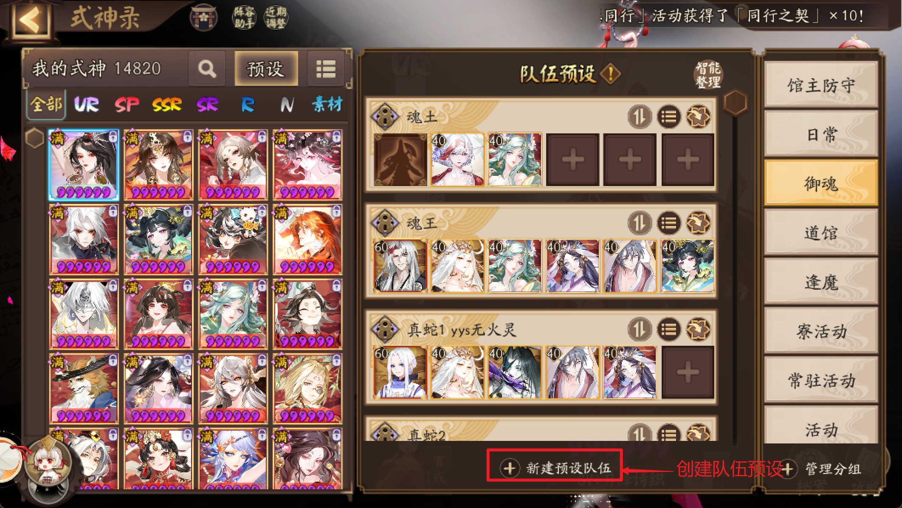
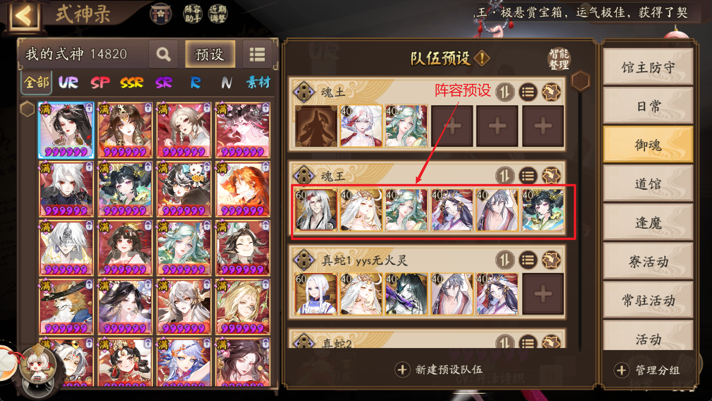
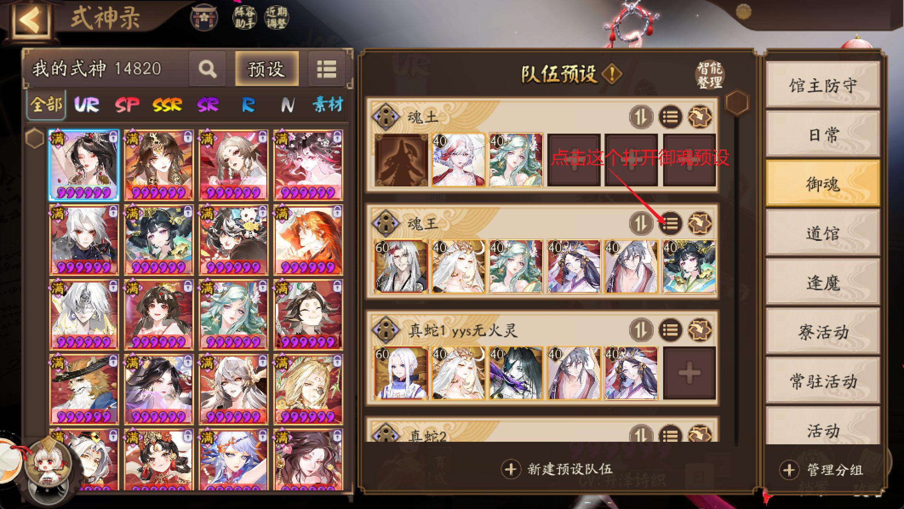
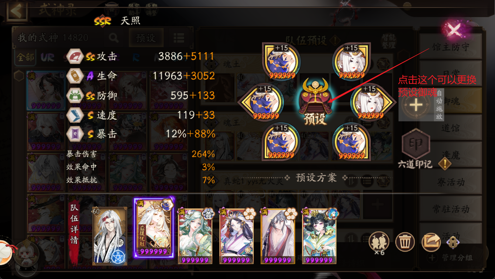
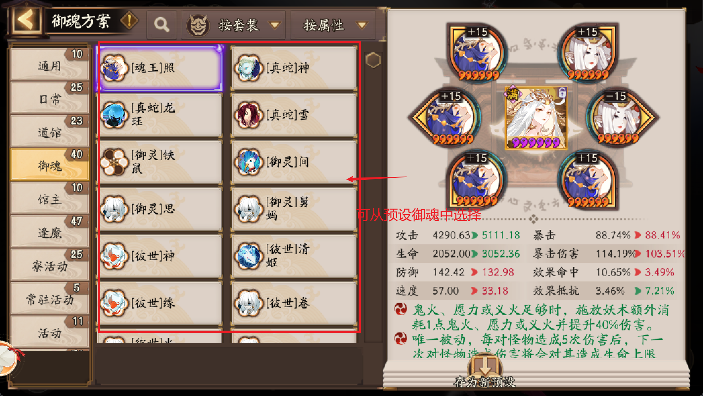
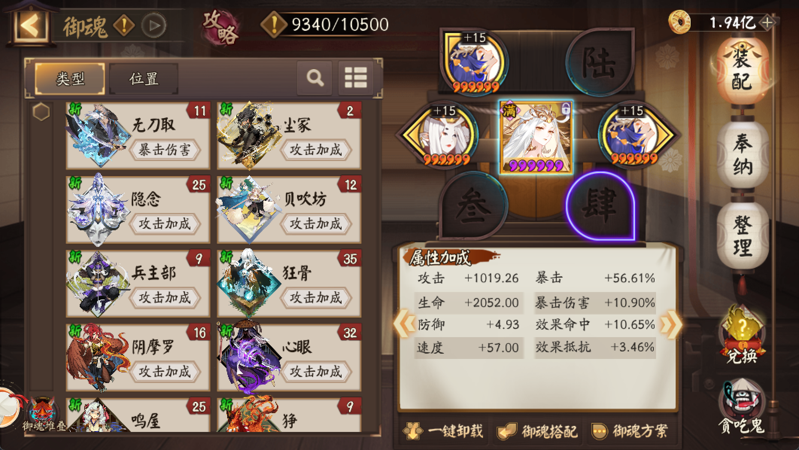
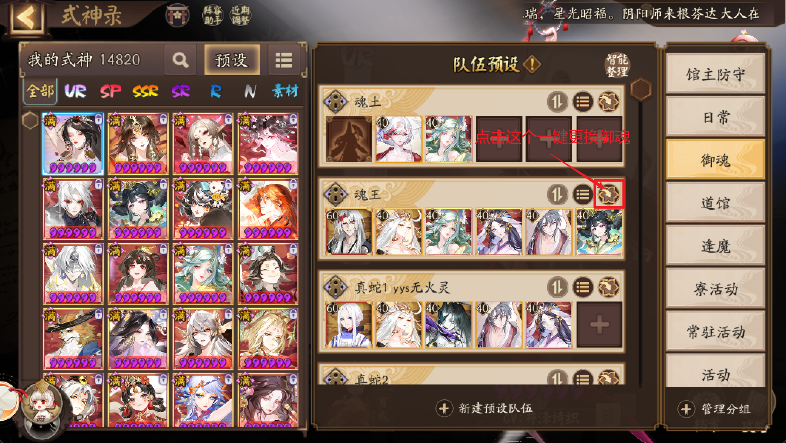
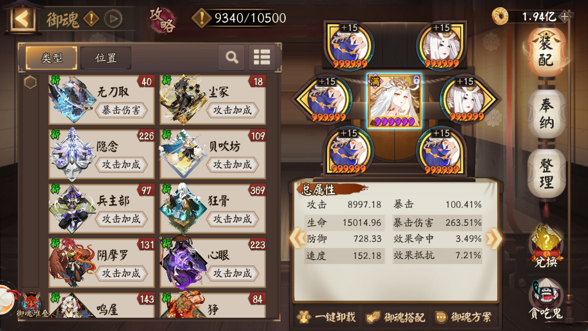

# 阴阳师游戏部分指南教程

## 式神预设

### 预设使用

1. 创建队伍预设

2. 新增阵容预设

点击左侧式神可添加至阵容

3. 新增式神的御魂预设

先点击 “三个点” 的按钮

打开 “阵容御魂预设” 的界面

点击 “预设”

将保存的 “御魂预设” 应用到式神身上（让式神穿戴），以此类推

### 应用阵容预设

比如原本式神的御魂是这样的，御魂没带全，但是需要马上打魂王副本

点击最右侧的 “箭头” 图标，可以一键穿戴这个阵容预设的式神御魂

再次查看式神对应的御魂，已经应用了阵容预设的式神御魂

